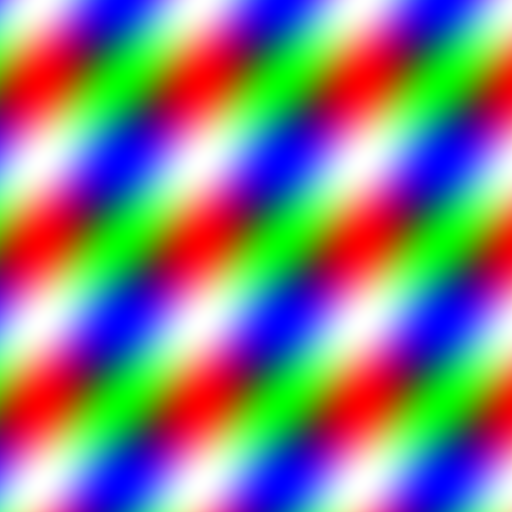
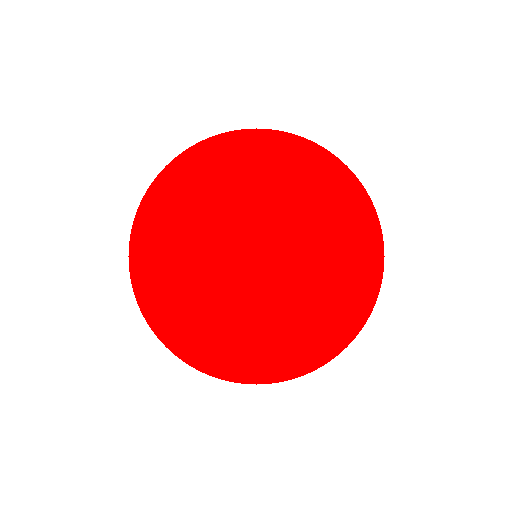

# Shader Rasterizer

This project is a small experimental CPU based shader rasterizer. 
It generates procedural textures as PNG images using simple fragment shaders. 

## Shader Examples

### Stripes


### Japan


### Circles


## Build & Run

Run the build script to compile the program:

```bash
    ./build.sh
```

Run the program with a shader name as argument:

```bash
    ./build/program stripes
```

```bash
    ./build/program circles
```

```bash
    ./build/program japan
```

If no shader name is provided, the program will use stripes by default.
The generated PNG file will be saved in the images/ folder as output.png

### References: 
https://www.youtube.com/watch?v=_SufQh6OIzs&list=PLpM-Dvs8t0VYgJXZyQzWjfYUm3MxcvqR0&index=2

https://learn.microsoft.com/en-us/windows/win32/medfound/image-stride
